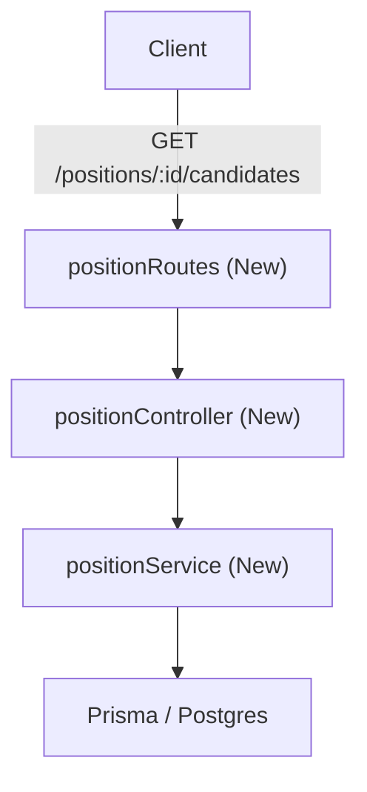

# Design: Get Position Candidates (`position-candidates`)

## 1. Introduction
This document details the technical design for the `position-candidates` capability, allowing job positions' candidates to be retrieved securely and cleanly.

## 2. Architecture & File Changes



### Proposed Changes and New Files
- **[backend/src/index.ts](file:///Users/develop/Workspace/Courses/LidrCo/AI4Devs/AI4Devs-backend-2604/backend/src/index.ts)**: Mount `positionRoutes` at `/positions` using `app.use('/positions', positionRoutes)`.
- **[backend/src/routes/positionRoutes.ts](file:///Users/develop/Workspace/Courses/LidrCo/AI4Devs/AI4Devs-backend-2604/backend/src/routes/positionRoutes.ts)**: Defines the routing entry points, routing requests to the controller.
- **[backend/src/presentation/controllers/positionController.ts](file:///Users/develop/Workspace/Courses/LidrCo/AI4Devs/AI4Devs-backend-2604/backend/src/presentation/controllers/positionController.ts)**: Handles HTTP-level parameters (e.g. validating parameter `id`), calls the application service, handles errors (404 and 500), and sends JSON responses.
- **[backend/src/application/services/positionService.ts](file:///Users/develop/Workspace/Courses/LidrCo/AI4Devs/AI4Devs-backend-2604/backend/src/application/services/positionService.ts)**: Implements database querying logic using Prisma Client.
- **[backend/src/domain/models/Position.ts](file:///Users/develop/Workspace/Courses/LidrCo/AI4Devs/AI4Devs-backend-2604/backend/src/domain/models/Position.ts)**: Uses `Position.findOne` static method.
- **[backend/tests/position.test.ts](file:///Users/develop/Workspace/Courses/LidrCo/AI4Devs/AI4Devs-backend-2604/backend/tests/position.test.ts)**: Contains unit and integration tests using `supertest` or direct routing tests.

---

## 3. Technical Approach & Design Decisions

### 3.1 Architecture Decisions
1. **Validation & HTTP Status Separation**:
   - The service checks if the position exists using `Position.findOne(id)`.
   - If `Position.findOne(id)` returns `null`, the controller responds with `404 Not Found`.
   - If the position exists but has no applications, it returns `200 OK` with an empty array `[]`.
2. **Data Querying Security & Restrictive Version**:
   - The query uses `prisma.application.findMany` with select projection to pull only `id`, `candidate` (with `id`, `firstName`, and `lastName`), `interviewStep` (with `name`), and `interviews` (with `score`).
   - Projection minimizes DB payload, prevents sensitive candidate data exposure, and enhances latency characteristics.

### 3.2 Endpoint Specification
- **URL**: `GET /positions/:id/candidates`
- **Path Parameters**:
   - `id`: integer representation of the target position ID.
- **Responses**:
   - `200 OK`: Array of candidates
   - `404 Not Found`: Position does not exist
   - `400 Bad Request`: Invalid ID format (e.g. non-integer)

#### Payload Schema (200 OK)
```json
[
  {
    "id": "cand-1",
    "fullName": "Jane Doe",
    "current_interview_step": "Technical Interview",
    "average_score": 85.0
  }
]
```

### 3.3 Average Score Calculation Rules
- Retrieve all associated `interviews` for each candidate application.
- Filter out `null` or `undefined` scores.
- Compute arithmetic mean: `sum(non_null_scores) / count(non_null_scores)`.
- If no interviews exist, or all interview scores are null, returns `null`.

---

## 4. Testing Strategy

We will use Jest and `supertest` to test endpoints and business units.

### Test Scenarios
1. **Position Not Found**: Retrieve with non-existent ID -> expects `404 Not Found`.
2. **Empty Candidates List**: Position exists but has no active applications -> expects `200 OK` and `[]`.
3. **Happy Path**: Position exists, calculates candidate lists, concatenates full names, and correctly averages scores (including ignoring null scores).

---

## 5. Execution Steps
1. Create `positionRoutes.ts`, `positionController.ts`, and `positionService.ts`.
2. Register the router in `index.ts`.
3. Write test suites in `tests/position.test.ts` matching the spec requirements.
4. Execute test suites to verify implementation.
