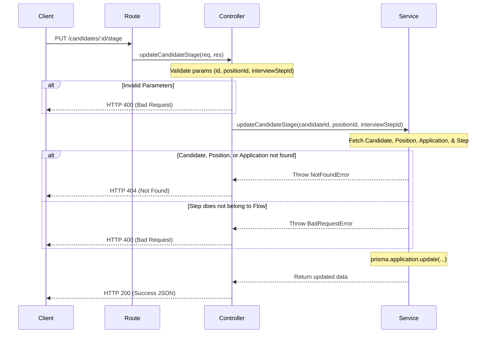

# Design Document: Update Candidate Stage (`PUT /candidates/:id/stage`)

This document outlines the technical design for updating the current interview step/stage of a candidate's application.

## 1. Architecture & Flow

The request flows sequentially through the controller, service, database layer, and returns the response.



## 2. File Changes

### 2.1 Route Mapping
- **File**: `backend/src/routes/candidateRoutes.ts`
- **Change**: Register the path parameter put route:
  ```typescript
  router.put('/:id/stage', updateCandidateStage);
  ```

### 2.2 Presentation Layer / Controller
- **File**: `backend/src/presentation/controllers/candidateController.ts`
- **Change**: Define `updateCandidateStage` to:
  1. Extract path param `id` and body params `positionId` and `interviewStepId`.
  2. Perform numeric validations: ensure `candidateId`, `positionId`, and `interviewStepId` are integers. Return HTTP `400` on validation failure.
  3. Call service layer inside a `try/catch` block.
  4. Map error types/messages to response statuses:
     - "Candidate not found", "Position not found", "Application not found" $\rightarrow$ `404`
     - "Interview step does not belong to position flow" $\rightarrow$ `400`
     - Other errors $\rightarrow$ `500`
  5. Return HTTP `200` with the response body:
     ```json
     {
       "message": "Stage updated successfully",
       "candidateId": <candidateId>,
       "interviewStepId": <interviewStepId>
     }
     ```

### 2.3 Application Layer / Service
- **File**: `backend/src/application/services/candidateService.ts`
- **Change**: Add `updateCandidateStage(candidateId: number, positionId: number, interviewStepId: number)` containing:
  - **Check Candidate**: `prisma.candidate.findUnique({ where: { id: candidateId } })` $\rightarrow$ Throw error if missing.
  - **Check Position**: `prisma.position.findUnique({ where: { id: positionId } })` $\rightarrow$ Throw error if missing.
  - **Check Application**: `prisma.application.findFirst({ where: { candidateId, positionId } })` $\rightarrow$ Throw error if missing.
  - **Check InterviewStep**: Retrieve `InterviewStep` where `id = interviewStepId` and `interviewFlowId = position.interviewFlowId`. If not found $\rightarrow$ Throw error ("Interview step does not belong to position flow").
  - **Update**: `prisma.application.update({ where: { id: application.id }, data: { currentInterviewStep: interviewStepId } })`.

## 3. Database / Prisma Approach
- We use relational queries matching `id` columns.
- The update operation targets the existing candidate application identified by `application.id`, updating the `currentInterviewStep` field.

## 4. Testing Strategy
- **File**: `backend/tests/candidateStage.test.ts`
- **Framework**: Jest & Supertest.
- **Scenarios to cover**:
  1. **Success Flow (200)**: Candidate, position, application, and step matching, leading to update confirmation.
  2. **Invalid Input (400)**: Non-integer path or body parameters.
  3. **Candidate Not Found (404)**: Candidate query returns null.
  4. **Position Not Found (404)**: Position query returns null.
  5. **Application Not Found (404)**: No application links candidate to position.
  6. **Mismatched Step (400)**: Target interviewStep is not part of the position's interview flow.
- A database transaction rollback or clean database seeding will run before/after tests to ensure environment cleanliness.
